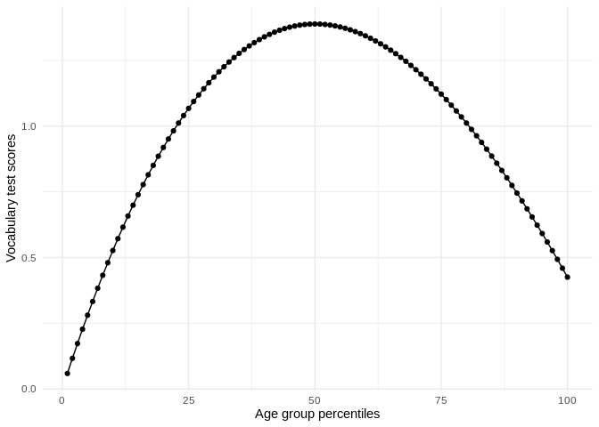

# perccalc <a href='https://cimentadaj.github.io/perccalc/'></a>

[](http://cran.r-project.org/package=perccalc)
[](https://travis-ci.org/cimentadaj/perccalc)
[](https://ci.appveyor.com/project/cimentadaj/perccalc)
[](https://codecov.io/gh/cimentadaj/perccalc?branch=master)
[](https://doi.org/10.21105/joss.01796)

## Overview

`perccalc` is a direct implementation of the theoretical work of
[Reardon
(2011)](https://www.russellsage.org/publications/whither-opportunity)
where it is possible to estimate the difference between two percentiles
from an ordered categorical variable. More concretely, by specifying an
ordered categorical variable and a continuous variable, this method can
estimate differences in the continuous variable between percentiles of
the ordered categorical variable. This brings forth a relevant strategy
to contrast ordered categorical variables which usually have alternative
continuous measures to the percentiles of the continuous measures.
Moreover, this opens an avenue for calculating percentile distributions
and percentile differences for ordered categorical variables which don’t
necessarily have an alternative continuous measure such as job
occupation classifications. With this package I introduce two functions
that apply the procedure.

The package has two main functions:

  - `perc_diff`, for calculating percentile differences
  - `perc_dist`, for calculating scores for all percentiles

## Installation

You can install and load the package with these commands:

``` r
install.packages("perccalc") # for stable version
# or
devtools::install_github("cimentadaj/perccalc") # for development version
```

## Usage

To look at a real world example, let’s use the data from the General
Social Survey (GSS). This dataset contains information on the responses
given by subjects on a vocabulary test together with their age expressed
in age groups (such as `30-39`, `40-49`, etc…). We’re interested in
calculating the difference in vocabulary test scores between the old and
young respondents.

In many scenarios, we could calculate the difference between these
groups in their vocabulary tests by estimating the mean difference
between two age groups (for example, ages `20-29` versus ages `60-69`).
However, in many other settings we’re specifically interested in the
difference of vocabulary tests by the percentiles of the age variable.
In particular, this could be of interest for studies looking to contrast
their results to other studies which have age as a continuous variable.
In our example, age is a categorical variable so we cannot calculate
percentiles. The method implemented in this package introduces a
strategy for calculating percentiles from ordered categories.

Let’s load our packages of interest and limit the GSS data to the year
1978.

``` r
library(perccalc)
library(dplyr)
library(ggplot2)
library(carData)

set.seed(213141)
data("GSSvocab")

gss <- 
  as_tibble(GSSvocab) %>% 
  filter(year == "1978") %>% 
  mutate(weight = sample(1:3, size = nrow(.), replace = TRUE, prob = c(0.1, 0.5, 0.4)),
         ageGroup = factor(ageGroup, ordered = TRUE)) %>%
  select(ageGroup, vocab, weight)
```

Note that the categorical variable (`ageGroup`) has to be an ordered
factor (this is a requirement of both functions). Moving to the example,
`perc_diff` calculates the difference in the continuous variable by the
percentiles of the ordered categorical variable. In our example, this
would the question of what’s the difference in vocabulary test scores
between the 90th and 10th percentile of age groups?

``` r
perc_diff(gss, ageGroup, vocab, percentiles = c(90, 10))
#> difference         se 
#>  0.2185802  0.3905549
```

It’s about .21 points with a standard error of .39 points. In addittion,
you can optionally add weights with the `weights` argument.

``` r
perc_diff(gss, ageGroup, vocab, percentiles = c(90, 10), weights = weight)
#> difference         se 
#>  0.1760728  0.3775078
```

On the other hand, the `perc_dist` (short for percentile distribution)
allows you to estimate the score for every percentile and not limit the
analysis to only the difference between two percentiles.

``` r

perc_dist <- perc_dist(gss, ageGroup, vocab)
perc_dist
#> # A tibble: 100 x 3
#>   percentile estimate std.error
#>        <int>    <dbl>     <dbl>
#> 1          1   0.0590    0.0588
#> 2          2   0.117     0.115 
#> 3          3   0.173     0.169 
#> 4          4   0.227     0.220 
#> 5          5   0.281     0.268 
#> # … with 95 more rows
```

We could visualize this in a more intuitive representation:

``` r
perc_dist %>%
  ggplot(aes(percentile, estimate)) +
  geom_point() +
  geom_line() +
  theme_minimal() +
  labs(x = "Age group percentiles",
       y = "Vocabulary test scores")
```

<!-- -->

This function also allows the use of weights.

## Documentation and Support

Please visit <https://cimentadaj.github.io/perccalc/> for documentation
and vignettes with real-world examples. In case you want to file an
issue or contribute in another way to the package, please follow this
[guide](https://github.com/cimentadaj/perccalc/blob/master/.github/CONTRIBUTING.md).
For questions about the functionality, feel free to file an issue on
Github.

  - Reardon, Sean F. “The widening academic achievement gap between the
    rich and the poor: New evidence and possible explanations.” Whither
    opportunity (2011): 91-116.
